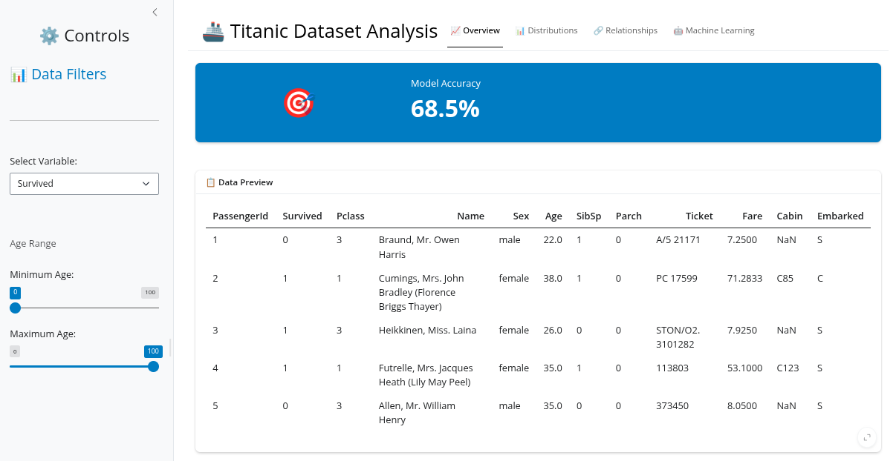
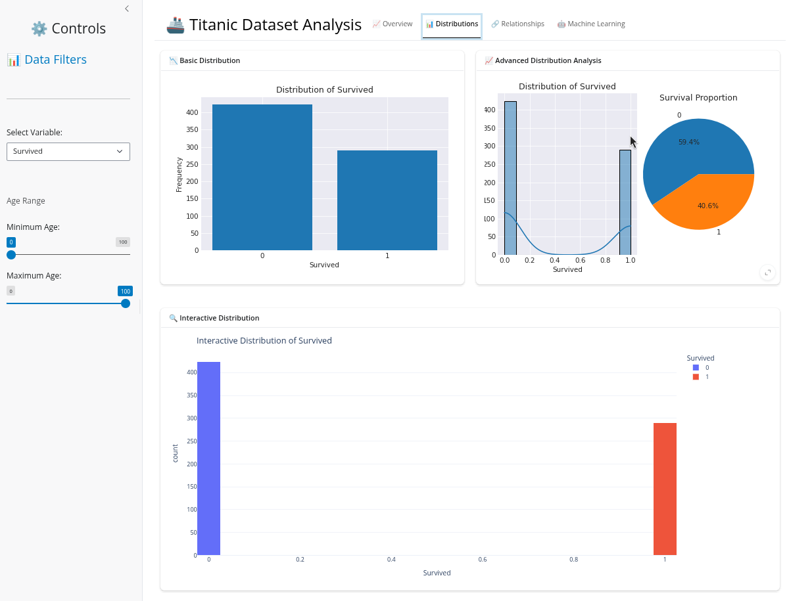
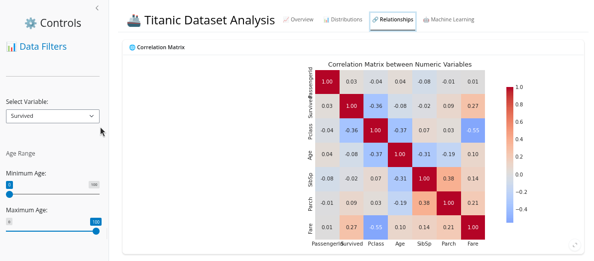
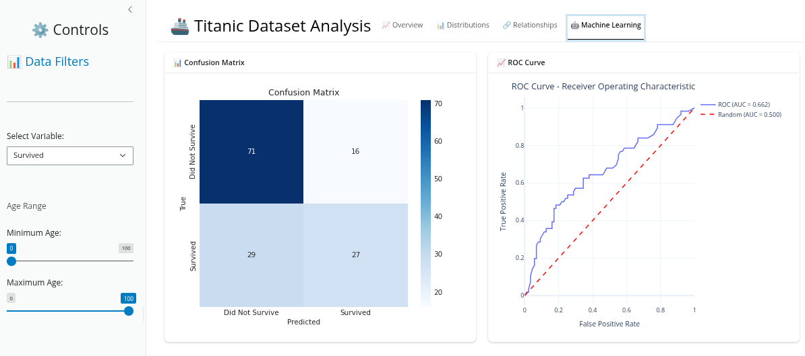

# Titanic Dataset Analysis - Shiny Application

## Purpose

This application constitutes a comprehensive analytical instrument designed for the examination and evaluation of machine learning models pertaining to the renowned Titanic challenge from Kaggle. The application provides an interactive environment wherein users may explore the dataset, visualize relationships between variables, and assess the performance of predictive models through a sophisticated web interface.

The choice of Shiny for this endeavor aligns with its foundational philosophy of reactive programming, wherein user interactions automatically trigger computational updates throughout the application. This paradigm ensures that data transformations, visualizations, and model evaluations remain synchronized with user inputs, creating a seamless analytical experience that embodies the principle of declarative reactivity—a cornerstone of modern interactive data science applications.

## Application Tabs

The application is organized into four distinct analytical perspectives, each corresponding to a dedicated tab interface:

### Tab 1: Overview and Data Exploration



### Tab 2: Statistical Analysis



### Tab 3: Interactive Visualizations



### Tab 4: Model Evaluation



## Getting Started

### Prerequisites

- Docker and Docker Compose installed on your system

### Starting the Application

To initiate the application, execute the following command from the project root directory:

```bash
docker compose up -d
```

This command will:
- Build the Docker image containing all necessary dependencies
- Start the application container in detached mode
- Expose the application on port 8000

Once the container is running, access the application by navigating to `http://localhost:8000` in your web browser.

To stop the application, use:

```bash
docker compose down
```

## Technologies

This application leverages the following core technologies:

- **Shiny**: A Python framework for building interactive web applications that embodies reactive programming principles. Shiny enables the creation of dynamic interfaces where user inputs automatically propagate through the application's computational graph, ensuring that outputs remain consistent with the current state of inputs. This reactive paradigm eliminates the need for imperative event handling, instead relying on declarative relationships between inputs and outputs—a design philosophy that promotes both code clarity and maintainability.

- **Pandas**: A powerful data manipulation and analysis library that provides the foundational data structures and operations necessary for processing the Titanic dataset. Pandas' DataFrame abstraction serves as the primary data container throughout the application, facilitating filtering, aggregation, and transformation operations that feed into both visualizations and machine learning pipelines. The library's expressive API and efficient implementation make it an indispensable tool for exploratory data analysis within the Shiny ecosystem.

## Features

- **Interactive Filtering**: Filter passengers by age range and analyze selected variables
- **Descriptive Statistics**: View statistical summaries of the filtered dataset
- **Visualizations**: 
  - Static charts (survival distribution, advanced distributions, correlation matrices)
  - Interactive Plotly charts for exploratory analysis
  - 3D relationship visualizations
- **Machine Learning**: Train logistic regression models and evaluate performance through:
  - Model metrics display
  - Confusion matrix visualization
  - Interactive ROC curve analysis
